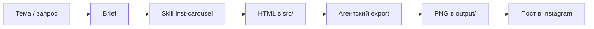

# pc-media-lab

Учебный шаблон медиа-отдела для Personal Corp (урок L6): агент производит медиа по правилам, а не «просто генерит картинку в чате».

## Зачем этот репозиторий

Медиа-отдел — это маленькая цифровая фабрика. На входе тема или сырой запрос. На выходе — файлы, которые можно сразу запостить. Всё, что нужно агенту для повтора, лежит в репозитории: правила, skill, тема оформления, лог прогона.

Этот шаблон специально узкий. Runnable-пайплайн один: **инст-карусель кодом**. Картинки и видео через подписки сюда можно добавить позже — внизу есть stubs.

## Как устроен отдел



- `AGENTS.md` — что агент обязан делать (исполняемый минимум).
- `skills/inst-carousel/` — весь контракт пайплайна и тема Factory.
- `output/inst-carousel/<дата-slug>/` — **только картинки для поста**; исходники в `src/` рядом.
- `vocabulary.md` — словарь терминов.

## Два уровня одного skill (stateful)

Один skill, два состояния. README рассказывает историю; команды и критерии — в `AGENTS.md` и `SKILL.md`.

### Уровень 1 — получить postable слайды

1. Зафиксировать тему и brief.
2. Выбрать тему оформления (`themes/factory`).
3. Собрать карусель кодом в `src/index.html`.
4. Агент сам экспортирует слайды в PNG 1080×1080.
5. В корне run лежат `slide-01.png` … — их можно сразу забрать в Instagram.

Ручной скрин и «открой preview сам» не считаются завершением уровня 1.

### Уровень 2 — review и финал

Смотришь картинки, даёшь правки. Агент правит `src/`, снова экспортирует, обновляет `run.json`. Тот же run-folder, следующее состояние.

## Demo

В репозитории уже есть прогон:

`output/inst-carousel/2026-08-11-media-department/`

Тема: «Как устроен медиа-отдел». Стиль: Factory. Visible text: русский.

## Запуск с агентом

Открой эту папку в Cursor / Codex / Claude Code и скажи:

> Сделай инст-карусель по теме «…» через skill inst-carousel, тема Factory.

Агент прочитает `AGENTS.md` и `skills/inst-carousel/SKILL.md`, соберёт HTML и сам вызовет export.

Локально export можно так (делает агент, не студент):

```bash
python3 skills/inst-carousel/export.py output/inst-carousel/<date-slug>
```

Нужны: Python 3, пакет `playwright`, браузер Chromium (`playwright install chromium`).

## Что дальше (stubs)

Пока не runnable в этом шаблоне — подключи, когда появится подписка или API:

| Capability | Статус | Заметка |
|---|---|---|
| Инст-карусель кодом | ✅ runnable | этот skill |
| Обложки / imagegen | stub | нужен image model / API |
| Видео / motion | stub | код или video model |
| Аудио / voice | stub | TTS API или системный голос |
| Reusable cover styles | stub | вынести удачную тему из `themes/` |

## Связь с private warehouse

Рабочий склад прогонов может жить отдельно (например, `corp-media`). Этот репозиторий — чистый starter для урока и переиспользования, без личных ассетов.
